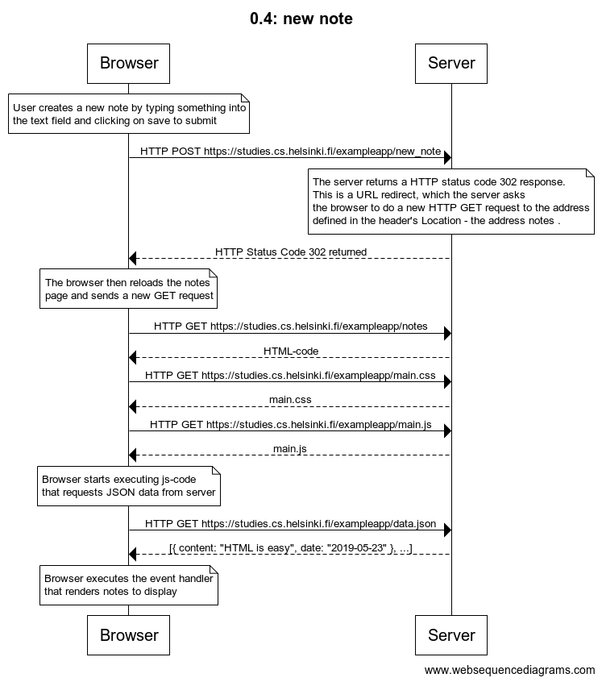
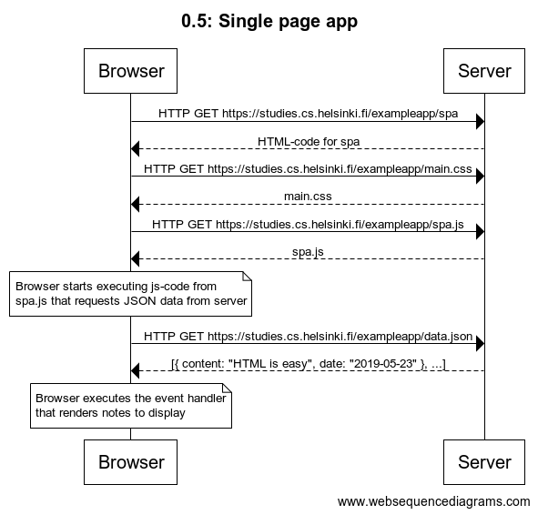
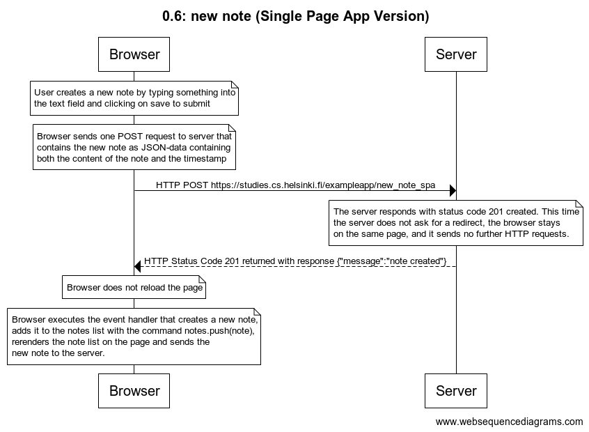

# [Fundamentals of Web apps](https://fullstackopen.com/en/part0/fundamentals_of_web_apps)

## 0.1: HTML

Review the basics of HTML by reading this tutorial from Mozilla: [HTML tutorial](https://developer.mozilla.org/en-US/docs/Learn/Getting_started_with_the_web/HTML_basics)

## 0.2: CSS

Review the basics of CSS by reading this tutorial from Mozilla: [CSS tutorial](https://developer.mozilla.org/en-US/docs/Learn/Getting_started_with_the_web/CSS_basics)

## 0.3: HTML forms

Learn about the basics of HTML forms by reading Mozilla's tutorial: [Your first form](https://developer.mozilla.org/en-US/docs/Learn/Forms/Your_first_form)

## 0.4: new note

Create a similar diagram depicting the situation where the user creates a new note on page https://studies.cs.helsinki.fi/exampleapp/notes by writing something into the text field and clicking the submit button.

## Answer



The diagram was made using the [websequencediagrams](https://www.websequencediagrams.com/) service as follows:

```
title 0.4: new note

note over Browser:
User creates a new note by typing something into
the text field and clicking on save to submit
end note

Browser->Server: HTTP POST https://studies.cs.helsinki.fi/exampleapp/new_note

note over Server:
The server returns a HTTP status code 302 response.
This is a URL redirect, which the server asks
the browser to do a new HTTP GET request to the address
defined in the header's Location - the address notes .
end note

Server-->Browser: HTTP Status Code 302 returned

note over Browser:
The browser then reloads the notes
page and sends a new GET request
end note

Browser->Server:  HTTP GET https://studies.cs.helsinki.fi/exampleapp/notes
Server-->Browser: HTML-code
Browser->Server:  HTTP GET https://studies.cs.helsinki.fi/exampleapp/main.css
Server-->Browser: main.css
Browser->Server:HTTP GET https://studies.cs.helsinki.fi/exampleapp/main.js
Server-->Browser:main.js

note over Browser:
Browser starts executing js-code
that requests JSON data from server
end note

Browser->Server: HTTP GET https://studies.cs.helsinki.fi/exampleapp/data.json
Server-->Browser: [{ content: "HTML is easy", date: "2019-05-23" }, ...]

note over Browser:
Browser executes the event handler
that renders notes to display
end note
```

## 0.5: Single page app

Create a diagram depicting the situation where the user goes to the single page app version of the notes app at https://studies.cs.helsinki.fi/exampleapp/spa .

## Answer



The diagram was made using the [websequencediagrams](https://www.websequencediagrams.com/) service as follows:

```
title 0.5: Single page app

Browser->Server:  HTTP GET https://studies.cs.helsinki.fi/exampleapp/spa
Server-->Browser: HTML-code for spa
Browser->Server:  HTTP GET https://studies.cs.helsinki.fi/exampleapp/main.css
Server-->Browser: main.css
Browser->Server:HTTP GET https://studies.cs.helsinki.fi/exampleapp/spa.js
Server-->Browser:spa.js

note over Browser:
Browser starts executing js-code from
spa.js that requests JSON data from server
end note

Browser->Server: HTTP GET https://studies.cs.helsinki.fi/exampleapp/data.json
Server-->Browser: [{ content: "HTML is easy", date: "2019-05-23" }, ...]

note over Browser:
Browser executes the event handler
that renders notes to display
end note

```

## 0.6: New note - Single page app

Create a diagram depicting the situation where the user goes to the single page app version of the notes app at https://studies.cs.helsinki.fi/exampleapp/spa .

## Answer



The diagram was made using the [websequencediagrams](https://www.websequencediagrams.com/) service as follows:

```
title 0.6: new note (Single Page App Version)

note over Browser:
User creates a new note by typing something into
the text field and clicking on save to submit
end note

note over Browser:
Browser sends one POST request to server that
contains the new note as JSON-data containing
both the content of the note and the timestamp
end note

Browser->Server: HTTP POST https://studies.cs.helsinki.fi/exampleapp/new_note_spa

note over Server:
The server responds with status code 201 created. This time
the server does not ask for a redirect, the browser stays
on the same page, and it sends no further HTTP requests.
end note

Server-->Browser: HTTP Status Code 201 returned with response {"message":"note created"}

note over Browser:
Browser does not reload the page
end note

note over Browser:
Browser executes the event handler that creates a new note,
adds it to the notes list with the command notes.push(note),
rerenders the note list on the page and sends the
new note to the server.
end note

```
